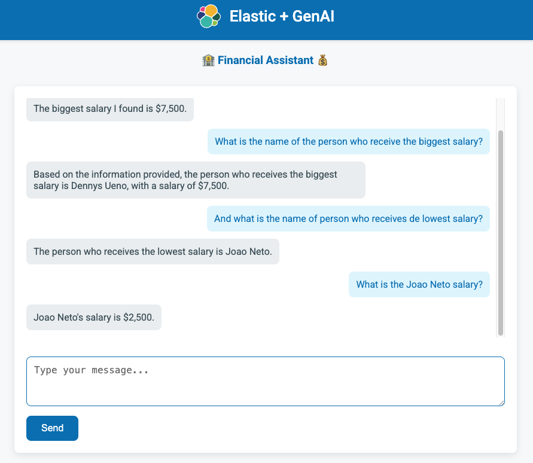

# 📊 Elastic Sales Assistant 🚀

Este projeto utiliza Flask, Elasticsearch e OpenAI para criar um assistente de vendas inteligente. A aplicação permite que os usuários façam perguntas sobre dados de vendas, que são processadas e respondidas com base em informações armazenadas no Elasticsearch.

## 🔧 Tecnologias Utilizadas
* **Flask:** Framework web para Python, usado para construir a API e interface da web.
* **Elasticsearch:** Ferramenta de busca e análise, usada para armazenar e consultar os dados financeiros.
* **OpenAI API:** Usada para gerar consultas Elasticsearch a partir de perguntas em linguagem natural e para formatar as respostas de maneira humanizada.
* **dotenv:** Carregamento das variáveis de ambiente de forma segura.

## 🌟 Funcionalidades Principais
* **Transformação de Perguntas em DSL:** As perguntas dos usuários em linguagem natural são convertidas em consultas Elasticsearch (DSL) usando a API OpenAI.
* **Execução de Consultas no Elasticsearch:** As consultas geradas são executadas no Elasticsearch para obter os dados financeiros relevantes.
* **Respostas Humanizadas:** A resposta do Elasticsearch é formatada em uma resposta natural usando a OpenAI API.

## 🛠️ Como Funciona o Código
### 1️⃣ Configuração do Ambiente
O código carrega variáveis de ambiente a partir de um arquivo .env utilizando a biblioteca dotenv. Isso permite que as credenciais e parâmetros sensíveis (como API keys) sejam gerenciados de forma segura.

```python
from dotenv import load_dotenv
load_dotenv()
```

### 2️⃣ Conexão com o Elasticsearch
A conexão com o Elasticsearch é feita utilizando o cliente oficial Elasticsearch do Python. As credenciais são passadas através das variáveis de ambiente.

```python
es = Elasticsearch(
    ELASTICSEARCH_ENDPOINT,
    api_key=ELASTICSEARCH_API_KEY
)
```

### 3️⃣ Gerando Consultas com OpenAI
Quando o usuário faz uma pergunta, o código utiliza a OpenAI para gerar uma consulta Elasticsearch (DSL) correspondente.

```python
def generate_dsl_query(question):
    # Converte a pergunta em uma consulta DSL
    prompt = f"""
    Instructions:
    - Your name now is Elastic Sales Assistant
    - Convert the following question into an Elasticsearch Query DSL...
    """
    response = openai.chat.completions.create(...)
    return response.choices[0].message.content.strip()
```

### 4️⃣ Executando Consultas no Elasticsearch
A consulta gerada é executada no Elasticsearch, retornando os dados relacionados à pergunta.

```python
def execute_query(index, query_dsl):
    # Executa a consulta no Elasticsearch
    response = es.search(index=index, body=query)
    return response
```

### 5️⃣ Formatando a Resposta
A resposta do Elasticsearch é processada e transformada em uma resposta natural com a ajuda do modelo OpenAI.

```python
def format_response(question, es_response):
    # Formata a resposta do Elasticsearch em uma resposta humanizada
    prompt = f"""
    Instructions:
    - Your name now is Elastic Financial Assistant
    - Convert the following document in a natural language to answer the question...
    """
    response = openai.chat.completions.create(...)
    return response.choices[0].message.content.strip()
```

### 6️⃣ API e Frontend
O Flask serve uma interface web básica com o arquivo index.html e oferece um ponto de API para processar as perguntas dos usuários.

```python
@app.route("/ask", methods=["POST"])
def ask_question():
    data = request.json
    question = data.get("question", "")
    dsl_query = generate_dsl_query(question)
    es_response = execute_query(INDEX_NAME, dsl_query)
    answer = format_response(question, es_response)
    return jsonify({"answer": answer})
```

## 🚀 Como Rodar o Projeto
### Pré-requisitos
* Python 3.x
* Elasticsearch em funcionamento
* Conta na OpenAI e a chave da API

### 1️⃣ Instale as Dependências

Execute o seguinte comando para instalar as bibliotecas necessárias:

```python
pip install -r requirements.txt
```

### 2️⃣ Configure as Variáveis de Ambiente

Crie um arquivo .env com as seguintes variáveis:


```python
OPENAI_API_KEY=SuaChaveOpenAI
ELASTICSEARCH_ENDPOINT=SeuEndpointElasticsearch
ELASTICSEARCH_API_KEY=SuaChaveElasticsearch
INDEX_NAME=NomeDoIndex
OPENAI_MODEL=ModeloEscolhido
```

### 3️⃣ Execute a Aplicação
Para rodar a aplicação Flask, use o seguinte comando:

```python
python app.py
```

A aplicação estará disponível em http://127.0.0.1:5000.

## 🧑‍💻 Exemplo de Uso
Acesse http://127.0.0.1:5000 e curta o projeto:



## 📄 Licença
Esse projeto está licenciado sob a [Apache Version 2.0](LICENSE).


